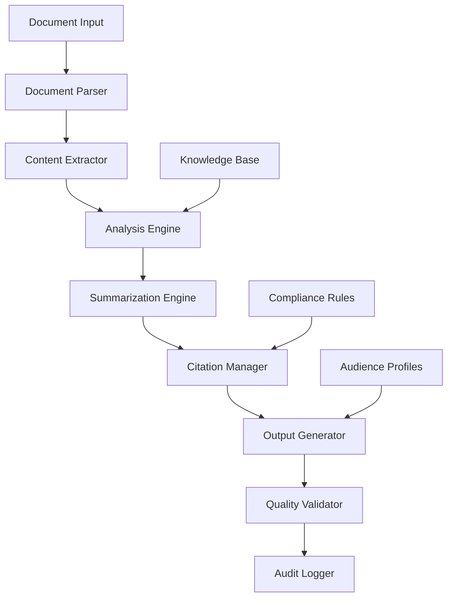

# Design Document: Clinical Research Documentation Assistant

## Overview

The Clinical Research Documentation Assistant is an AI-powered system that processes publicly available clinical research papers to generate accurate, well-cited summaries tailored for different healthcare audiences. The system emphasizes accuracy, transparency, and compliance with healthcare documentation standards while providing workflow automation for research review processes.

The architecture follows a modular design with clear separation between document processing, content analysis, summarization, and output generation components. All processing is performed on synthetic or publicly available data only, with strict privacy controls and audit logging throughout.

## Architecture

The system employs a pipeline architecture with the following key components:



### Core Processing Pipeline

1. **Document Ingestion**: Accepts PDF research papers with privacy validation
2. **Content Extraction**: Parses and structures document sections
3. **Analysis**: Identifies key findings, methodology, and limitations
4. **Summarization**: Generates audience-specific content with confidence scoring
5. **Citation Management**: Ensures proper academic referencing
6. **Quality Validation**: Validates accuracy and compliance
7. **Output Generation**: Produces formatted summaries with audit trails

### Data Flow Architecture

The system processes documents through distinct stages with validation checkpoints:

- **Input Validation**: Ensures documents contain only public research data
- **Structured Extraction**: Converts unstructured text to structured data
- **Content Analysis**: Applies NLP techniques for key information extraction
- **Quality Assessment**: Assigns confidence scores and identifies limitations
- **Output Formatting**: Generates audience-appropriate summaries with citations

## Components and Interfaces

### Document Parser Component

**Responsibilities:**
- PDF text extraction and structure recognition
- Section identification (abstract, methodology, results, conclusions)
- Privacy validation to reject documents with patient data
- Error handling for malformed or unsupported documents

**Interfaces:**
```typescript
interface DocumentParser {
  parseDocument(file: File): Promise<ParsedDocument>
  validatePrivacy(content: string): Promise<PrivacyValidationResult>
  extractSections(content: string): DocumentSections
}

interface ParsedDocument {
  sections: DocumentSections
  metadata: DocumentMetadata
  privacyStatus: PrivacyValidationResult
}
```

### Content Extractor Component

**Responsibilities:**
- Key finding identification and extraction
- Statistical result parsing (p-values, confidence intervals, effect sizes)
- Methodology detail extraction
- Limitation and bias detection

**Interfaces:**
```typescript
interface ContentExtractor {
  extractKeyFindings(sections: DocumentSections): KeyFinding[]
  extractStatisticalResults(content: string): StatisticalResult[]
  extractMethodology(methodSection: string): MethodologyDetails
  identifyLimitations(content: string): Limitation[]
}

interface KeyFinding {
  content: string
  confidenceScore: number
  sourceSection: string
  statisticalSupport?: StatisticalResult
}
```

### Analysis Engine Component

**Responsibilities:**
- Confidence scoring for extracted information
- Bias detection and flagging
- Cross-referencing with medical knowledge bases
- Quality assessment and validation

**Interfaces:**
```typescript
interface AnalysisEngine {
  assessConfidence(finding: KeyFinding): ConfidenceAssessment
  detectBias(methodology: MethodologyDetails): BiasIndicator[]
  validateAgainstKnowledgeBase(finding: KeyFinding): ValidationResult
  assessStudyQuality(document: ParsedDocument): QualityScore
}

interface ConfidenceAssessment {
  score: number // 0-1 scale
  factors: ConfidenceFactor[]
  requiresReview: boolean
}
```

### Summarization Engine Component

**Responsibilities:**
- Audience-specific content generation
- Length and complexity adjustment
- Synthesis vs. direct quotation management
- Preservation of original meaning and context

**Interfaces:**
```typescript
interface SummarizationEngine {
  generateSummary(content: ExtractedContent, audience: AudienceType): Summary
  adjustComplexity(content: string, targetLevel: ComplexityLevel): string
  synthesizeFindings(findings: KeyFinding[]): SynthesizedContent
  preserveContext(original: string, summary: string): ContextValidation
}

interface Summary {
  content: string
  audience: AudienceType
  synthesisMarkers: SynthesisMarker[]
  confidenceLevel: number
}
```

### Citation Manager Component

**Responsibilities:**
- Academic citation formatting (AMA, APA, Vancouver styles)
- Source tracking and provenance management
- Bibliography generation
- Citation validation and completeness checking

**Interfaces:**
```typescript
interface CitationManager {
  formatCitation(source: DocumentMetadata, style: CitationStyle): string
  trackProvenance(content: string, source: DocumentMetadata): ProvenanceRecord
  generateBibliography(sources: DocumentMetadata[], style: CitationStyle): string
  validateCitations(content: string): CitationValidation
}

interface ProvenanceRecord {
  originalSource: DocumentMetadata
  extractedContent: string
  extractionMethod: string
  timestamp: Date
}
```

### Quality Validator Component

**Responsibilities:**
- Accuracy validation against source material
- Compliance checking with healthcare standards
- Conflict detection with established medical consensus
- Output quality scoring

**Interfaces:**
```typescript
interface QualityValidator {
  validateAccuracy(summary: Summary, source: ParsedDocument): AccuracyScore
  checkCompliance(output: GeneratedOutput): ComplianceResult
  detectConflicts(findings: KeyFinding[]): ConflictReport
  scoreQuality(output: GeneratedOutput): QualityMetrics
}

interface AccuracyScore {
  overallScore: number
  factualAccuracy: number
  contextPreservation: number
  citationAccuracy: number
}
```

## Data Models

### Core Document Models

```typescript
interface DocumentSections {
  abstract: string
  introduction?: string
  methodology: string
  results: string
  discussion: string
  conclusions: string
  limitations?: string
  references: string[]
}

interface DocumentMetadata {
  title: string
  authors: Author[]
  journal: string
  publicationDate: Date
  doi?: string
  pmid?: string
  keywords: string[]
}

interface Author {
  name: string
  affiliation?: string
  orcid?: string
}
```

### Analysis and Extraction Models

```typescript
interface StatisticalResult {
  type: 'p-value' | 'confidence-interval' | 'effect-size' | 'sample-size'
  value: number | [number, number]
  context: string
  significance: boolean
}

interface MethodologyDetails {
  studyDesign: string
  participantCriteria: string[]
  sampleSize: number
  dataCollection: string
  analysisMethod: string
  controlGroup?: string
}

interface Limitation {
  type: 'methodological' | 'statistical' | 'scope' | 'bias'
  description: string
  impact: 'low' | 'medium' | 'high'
  explicitlyStated: boolean
}
```

### Output and Quality Models

```typescript
interface GeneratedOutput {
  summary: Summary
  citations: Citation[]
  limitations: Limitation[]
  confidenceMetrics: ConfidenceMetrics
  audienceType: AudienceType
  generationTimestamp: Date
}

interface ConfidenceMetrics {
  overallConfidence: number
  extractionConfidence: number
  synthesisConfidence: number
  citationConfidence: number
}

type AudienceType = 'clinician' | 'researcher' | 'administrator'
type CitationStyle = 'AMA' | 'APA' | 'Vancouver'
type ComplexityLevel = 'basic' | 'intermediate' | 'advanced'
```

## Correctness Properties

*A property is a characteristic or behavior that should hold true across all valid executions of a system—essentially, a formal statement about what the system should do. Properties serve as the bridge between human-readable specifications and machine-verifiable correctness guarantees.*

Based on the prework analysis, the following properties ensure system correctness:

### Property 1: Document Processing Completeness
*For any* valid PDF research paper, the system should successfully parse the document and extract all required sections (abstract, methodology, results, conclusions) with appropriate error handling for invalid documents.
**Validates: Requirements 1.1, 1.2, 1.3**

### Property 2: Privacy and Data Validation
*For any* input document, the system should only process synthetic data or publicly available research publications, rejecting any documents containing patient data with appropriate alerts.
**Validates: Requirements 1.4, 7.1, 7.2**

### Property 3: Processing Isolation
*For any* set of documents processed simultaneously, the system should maintain separate processing contexts with no cross-contamination between documents.
**Validates: Requirements 1.5**

### Property 4: Content Synthesis Marking
*For any* generated summary, the system should clearly distinguish between direct quotes (limited to 30 words) and synthesized information with appropriate markers.
**Validates: Requirements 2.2, 2.3, 2.4**

### Property 5: Extraction Completeness
*For any* research paper, the system should identify and extract all available key findings, statistical results (p-values, confidence intervals, effect sizes), and methodology components.
**Validates: Requirements 3.1, 3.2, 3.3**

### Property 6: Confidence and Quality Assessment
*For any* extracted information, the system should assign confidence scores and flag low-confidence or ambiguous content for human review.
**Validates: Requirements 3.4, 3.5, 5.4, 9.1**

### Property 7: Citation and Bibliography Management
*For any* generated output, the system should include proper academic citations in specified format (AMA/APA/Vancouver), maintain complete bibliographies, and exclude uncitable content.
**Validates: Requirements 4.1, 4.2, 4.3, 4.5**

### Property 8: Provenance Tracking
*For any* extracted information, the system should maintain complete provenance records linking content to original sources.
**Validates: Requirements 4.4**

### Property 9: Limitation and Bias Detection
*For any* research paper, the system should identify explicitly stated limitations and detect common bias indicators (small samples, lack of controls, funding conflicts).
**Validates: Requirements 5.1, 5.2, 5.3, 5.5**

### Property 10: Audience-Specific Content Generation
*For any* specified audience type (clinician/researcher/administrator), the system should generate content emphasizing appropriate focus areas while maintaining accuracy.
**Validates: Requirements 6.1, 6.2, 6.3, 6.4**

### Property 11: Audit Logging and Compliance
*For any* processing activity, the system should maintain detailed audit logs and include required disclaimers in all outputs.
**Validates: Requirements 7.3, 7.5, 8.5**

### Property 12: Batch Processing and Workflow Automation
*For any* batch of multiple papers, the system should generate comparative analyses, structured reports, and provide export capabilities with progress tracking.
**Validates: Requirements 8.1, 8.2, 8.3, 8.4**

### Property 13: Knowledge Validation and Conflict Detection
*For any* generated content, the system should cross-reference against medical knowledge bases when available and flag conflicts with established consensus.
**Validates: Requirements 9.2, 9.3, 9.4**

### Property 14: Version Control and Human Oversight
*For any* generated summary, the system should maintain version control and support human corrections and annotations.
**Validates: Requirements 9.5**

## Error Handling

The system implements comprehensive error handling across all components:

### Document Processing Errors
- **Invalid PDF Format**: Return structured error with format requirements
- **Corrupted Files**: Provide clear error message and processing status
- **Privacy Violations**: Immediate rejection with privacy alert
- **Unsupported Content**: Graceful degradation with partial processing options

### Content Analysis Errors
- **Ambiguous Findings**: Flag for human review with confidence scores
- **Missing Sections**: Continue processing with available content, note limitations
- **Statistical Parsing Failures**: Mark statistical results as unavailable
- **Citation Failures**: Exclude uncitable content, maintain processing flow

### System-Level Errors
- **Concurrent Processing Issues**: Isolate failures to individual documents
- **Knowledge Base Unavailability**: Continue processing without cross-referencing
- **Export Failures**: Provide alternative formats and retry mechanisms
- **Audit Log Failures**: Fail-safe operation with error notification

### Error Recovery Strategies
- **Graceful Degradation**: Partial functionality when components fail
- **Retry Logic**: Automatic retry for transient failures
- **User Notification**: Clear error messages with actionable guidance
- **Fallback Processing**: Alternative processing paths for edge cases

## Testing Strategy

The system employs a dual testing approach combining unit tests for specific scenarios and property-based tests for comprehensive validation:

### Unit Testing Focus
- **Specific Document Formats**: Test parsing of various PDF structures
- **Edge Cases**: Empty sections, malformed citations, unusual statistical formats
- **Error Conditions**: Invalid inputs, corrupted files, privacy violations
- **Integration Points**: Component interactions and data flow validation
- **Audience-Specific Examples**: Sample outputs for each audience type

### Property-Based Testing Configuration

The system uses **Hypothesis** (Python) for property-based testing with the following configuration:
- **Minimum 100 iterations** per property test to ensure comprehensive coverage
- **Custom generators** for research paper structures, statistical data, and citation formats
- **Shrinking strategies** to find minimal failing examples
- **Deterministic seeding** for reproducible test runs

### Property Test Implementation

Each correctness property is implemented as a dedicated property-based test:

**Property Test Tags**: Each test includes a comment with the format:
```python
# Feature: clinical-research-assistant, Property 1: Document Processing Completeness
```

**Test Categories**:
1. **Document Processing Properties** (Properties 1-3): Test parsing, privacy validation, and isolation
2. **Content Generation Properties** (Properties 4, 10): Test synthesis marking and audience adaptation  
3. **Information Extraction Properties** (Properties 5-6): Test completeness and confidence assessment
4. **Citation and Provenance Properties** (Properties 7-8): Test citation formatting and tracking
5. **Quality Assurance Properties** (Properties 9, 13): Test limitation detection and validation
6. **Workflow Properties** (Properties 11-12, 14): Test logging, batch processing, and version control

### Test Data Strategy
- **Synthetic Research Papers**: Generated papers with known structure and content
- **Public Domain Papers**: Real papers from open access journals for integration testing
- **Edge Case Documents**: Malformed, incomplete, or unusual format papers
- **Privacy Test Cases**: Documents with synthetic patient data for rejection testing

### Validation Metrics
- **Accuracy Validation**: Compare extracted information against known ground truth
- **Citation Compliance**: Validate citation format against style guide specifications
- **Privacy Protection**: Ensure zero false positives in patient data detection
- **Performance Benchmarks**: Processing time and memory usage under load

### Continuous Testing
- **Automated Test Execution**: All tests run on every code change
- **Property Test Monitoring**: Track property test failure rates and patterns
- **Regression Detection**: Identify when changes break existing properties
- **Quality Gates**: Minimum test coverage and property test pass rates required for deployment